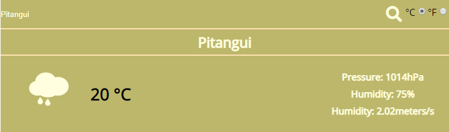

# Weather App

A weather app that pulls from the OpenWeatherMap API to allow users to search for and view the forecast in cities worldwide. Built with JavaScript.

## Screenshot

 

## Getting Started

Clone the repository into your local computer.

### Installing

First, you'll have to install the newest version of [Node](https://nodejs.org/en/download/). Otherwise, the npx command could not be available. Then move into the project main directory on the console and follow the instructions below. 

Install all packages:

```
$ npm install
```

Run Webpack:

```
$ npx webpack
```

Now open the `index.html` in the browser.


You can instruct webpack to "watch" all files within your dependency graph for changes. If one of these files is updated, the code will be recompiled so you don't have to run the full build manually:

```
$ npx webpack --watch
```

### webpack.config.js

The main file of which the bundle is created is set in the entry:

```
entry: './src/javascript/index.js'
```

The output file of the JavaScript bundle and its name is set in the output:

```
output: {
    path: path.resolve(__dirname, 'dist'),
    filename: 'main.js'
  },
```

[From Webpack documentation:](https://webpack.js.org/guides/production/) Technically, NODE_ENV is a system environment variable that Node.js exposes into running scripts. It is used by convention to determine dev-vs-prod behavior by server tools, build scripts, and client-side libraries. Contrary to expectations, process.env.NODE_ENV **is not set to "production"** within the build script webpack.config.js. Thus, conditionals like `process.env.NODE_ENV === 'production' ? '[name].[hash].bundle.js' : '[name].bundle.js'` within webpack configurations do not work as expected.

## Ideas for improvement

- Make the design responsive and look nicer
- Display more data to the user
- Be able to search by country or state, instead of just cities

## Built With

* [JavaScript](https://www.javascript.com/) - Programming language used
* [Webpack](https://webpack.js.org/) - Bundler used
* [HTML](https://en.wikipedia.org/wiki/HTML) - Hypertext Markup Language
* [SCSS](https://sass-lang.com/) - Sassy CSS
* [CSS](https://www.w3.org/Style/CSS/Overview.en.html) - Cascading Style Sheets
* [VS Code](https://code.visualstudio.com/) - The code editor used 

## Author

👤 **Vinicius Campos Carvalho**

<a href="https://github.com/kazumaki" rel="noopener noreferrer" target="_blank">

   

</a>

- Github: [@kazumaki](https://github.com/kazumaki)
- Twitter: [@iKazumaki](https://twitter.com/iKazumaki)
- Linkedin: [Vinicius Campos Carvalho](https://www.linkedin.com/in/vcamposcarvalho/)
- Email: [vcampos.pitangui@gmail.com](vcampos.pitangui@gmail.com)

## License

This project is licensed under the MIT License - see the [LICENSE](LICENSE) file for details

## Acknowledgments

* [TheOdinProject Project Page](https://www.theodinproject.com/courses/javascript/lessons/weather-app)
